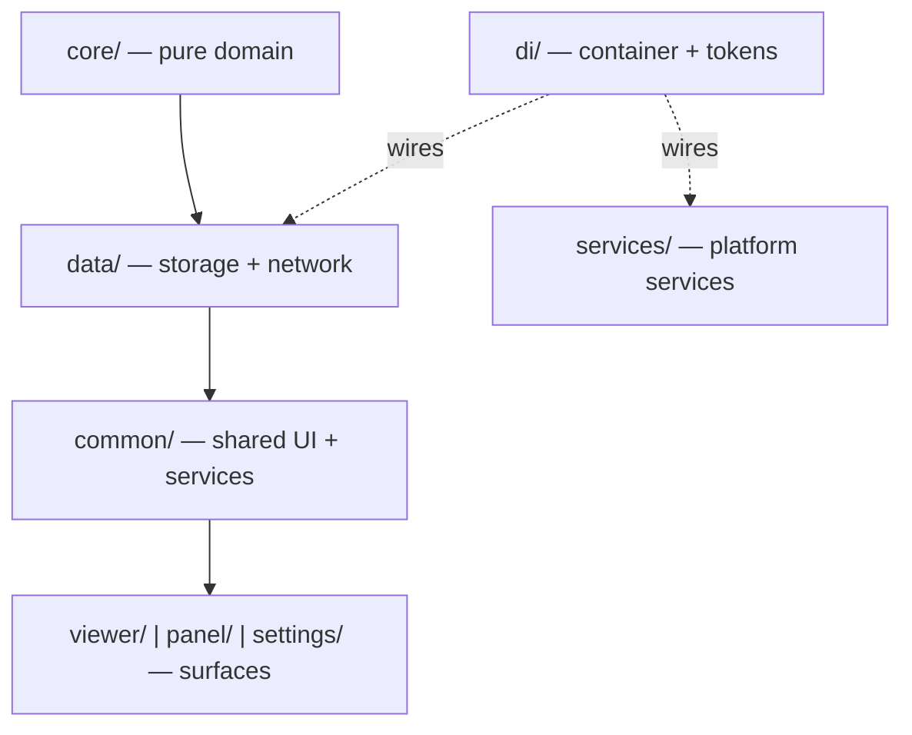

# Architecture

The extension is a **layered** architecture wired by a small dependency-injection
container. Dependency direction is strictly downward. Read this before adding
code; it is the standalone expansion of `docs/architecture.md`.

## Layered design

Dependency direction is strictly downward:
`core/ → data/ → common/ → viewer/ | panel/ | settings/`. This is the standalone
expansion of `docs/architecture.md` — the two must agree.

There is no top-level `services/`, `components/`, or `surfaces/` layer as a
single UI stack. Instead:

- **`services/`** (top level) holds platform-level services not owned by any
  surface (`PullService`, `ConnectionService`, `ScopeResolveService`,
  `QueueScope`, `ClassifierService`).
- **`common/`** holds shared UI units (`Component` base, `Modal`) and shared
  services (`RemoteBridge`, `SettingsService`).
- **Each surface** (`viewer/`, `panel/`, `settings/`) is a top-level folder that
  is self-contained: its HTML page, entry module, composition root, and its own
  surface-specific `components/` and `services/`.

All application source is TypeScript (`.ts`); esbuild strips the types. The only
`.js` sources are `content/content.js` and the `tools/` scripts.

## Directory map

| Layer       | Contents                                                                                                                                                                                                                                                                                                                                                                                                                                                                                                                                                                                                                                                                                                                                             |
| ----------- | ---------------------------------------------------------------------------------------------------------------------------------------------------------------------------------------------------------------------------------------------------------------------------------------------------------------------------------------------------------------------------------------------------------------------------------------------------------------------------------------------------------------------------------------------------------------------------------------------------------------------------------------------------------------------------------------------------------------------------------------------------- |
| `core/`     | Pure domain, grouped into subfolders. No DOM, no `chrome.*`, no I/O. Runs standalone in node. `timeline/` (`phase2` — the four rules —, `durations`, `journal`, `rowmerge`, `sntime`), `sla/` (`report`, `slasummary`, `ticketstats`, `statechoices`), `query/` (`querybuilder`, `wsrpreset`, `preset-controller`), `classification/` (`msrchoices`, `msrcategorize`, `aiextract`), `attention/` (`attention`, `calclens`), `export/` (`templatexml`, `rowfields`), `scope/` (`resolve-scope`), `summary/` (`summarydetails`, `names`, `change-summary-filter`).                                                                                                                                                                                     |
| `data/`     | Everything that touches storage or the network. `repositories/` (ticket, timeline, settings, dataset, run-state, export-config, viewer-prefs, template, filter-list, preset, msr-lists, change-summary), `datasource/` (`sn-transport` session auth, `sn-remote` client), `idb.ts`, `key-value-store.ts`, `chrome-key-value-store.ts`, `classification-cache-repository.ts`, `ml-model-repository.ts`.                                                                                                                                                                                                                                                                                                                                               |
| `common/`   | Shared UI and services used by more than one surface. `components/` (`Component` base, `Modal`); `services/` (`RemoteBridge`, `SettingsService`).                                                                                                                                                                                                                                                                                                                                                                                                                                                                                                                                                                                                    |
| `services/` | Platform-level services not owned by any surface: `PullService`, `ConnectionService`, `ScopeResolveService`, `QueueScope`, `ClassifierService`. No DOM; depends on repositories, never on components.                                                                                                                                                                                                                                                                                                                                                                                                                                                                                                                                                |
| `viewer/`   | The data-view surface, self-contained: `viewer.html`, `index.ts` (composition root), its modules (`core`, `store`, `grid`, `grid-data`, `cols`, `col-order`, `config-state`, `config-items`, `exporter`, `clipboard`, `summary`, `summary-details`, `toolbar`, `dialogs`, `selection`, `activity`, `classify`, `calclens`, `calclens-state`, `calclens-highlights`, `worker-client`, `shared`, `interactions`, `search-state`, `search-match`, `split-filter`, `split-preview`, `edit-mode-state`, `ticketstats`, `attention-filter`, `column-editor`), plus surface-only `components/` (`DataGrid`, `SearchPicker`, `ColumnEditor`, `CalclensPanel`, `CiDialog`, `MapDialog`) and `services/` (`ExportService`, `ReportService`, `ExtractService`). |
| `panel/`    | The side-panel surface, self-contained: `panel.html`, `panel.ts` (entry), `index.ts` (composition root), and surface-only `components/` (`LogCard`, `ProgressCard`, `ConditionBuilder`, `FilterSetList`).                                                                                                                                                                                                                                                                                                                                                                                                                                                                                                                                            |
| `settings/` | The options-page surface, self-contained: `settings.html`, `settings.ts` (entry), `index.ts` (composition root), and surface-only `components/` (`ChipList`).                                                                                                                                                                                                                                                                                                                                                                                                                                                                                                                                                                                        |
| `di/`       | Container, tokens, and per-surface registration functions (`container`, `token`, `tokens`, `register-core`, `register-background`).                                                                                                                                                                                                                                                                                                                                                                                                                                                                                                                                                                                                                  |
| `lib/`      | Platform and UI helpers: keys, storage, store, markup, picklist, servicenow, toast, tooltip, format, icons, icons-data.                                                                                                                                                                                                                                                                                                                                                                                                                                                                                                                                                                                                                              |
| `worker/`   | Off-thread ML classification: `classifier-worker`, `ml-classify`.                                                                                                                                                                                                                                                                                                                                                                                                                                                                                                                                                                                                                                                                                    |
| `platform/` | The service worker (`background.ts`).                                                                                                                                                                                                                                                                                                                                                                                                                                                                                                                                                                                                                                                                                                                |

### viewer/

The viewer page's own composition root (`viewer/index.ts`) plus its modules
(`core`, `store`, `grid`, `grid-data`, `cols`, `col-order`, `config-state`,
`config-items`, `exporter`, `clipboard`, `summary`, `summary-details`,
`toolbar`, `dialogs`, `selection`, `activity`, `classify`, `calclens`,
`calclens-state`, `calclens-highlights`, `worker-client`, `shared`,
`interactions`, `search-state`, `search-match`, `split-filter`,
`split-preview`, `edit-mode-state`, `ticketstats`, `attention-filter`,
`column-editor`). `viewer/index.ts` calls each module's `init*()` in a fixed
order and then boots. The viewer's own UI components live in
`viewer/components/` and its own services in `viewer/services/`.

**Nothing binds DOM handlers at module scope.** Every module exports an
`init*()` and the composition root decides when it runs. Adding top-level wiring
to a viewer module re-introduces the invisible ordering this replaced.

## Layering rules

| Layer                            | May use                              | Must never                                     |
| -------------------------------- | ------------------------------------ | ---------------------------------------------- |
| `core/`                          | only `core/`                         | `chrome.*`, `indexedDB`, `fetch`, DOM          |
| `lib/`                           | `core/`                              | other layers                                   |
| `data/`                          | `core/`, `lib/`, platform APIs       | DOM, `services/`, `common/`, surfaces          |
| `services/`                      | `core/`, `lib/`, `data/`             | DOM, `common/components/`                      |
| `common/components/`             | `core/`, `lib/`, services via `deps` | repositories, `chrome.*`, `indexedDB`, `fetch` |
| `viewer/`, `panel/`, `settings/` | everything                           | containing business logic                      |

## Download path (MV3 constraint)

The service worker never touches XLSX bytes. The viewer page loads the user's
cached template, patches only the target sheet's XML, and downloads via
`Blob` + `chrome.downloads.download`. Extension pages have
`URL.createObjectURL`; workers do not. Never move export building back into the
background. See [Export Internals](Export-Internals).

## Manifest and permissions

The extension is Manifest V3 (`manifest.json`). Key entries:

| Field                     | Value / purpose                                                                                                                                                                                 |
| ------------------------- | ----------------------------------------------------------------------------------------------------------------------------------------------------------------------------------------------- |
| `permissions`             | `storage`, `unlimitedStorage` (large IndexedDB caches), `downloads` (WSR export), `sidePanel`, `cookies` (read `g_ck`), `scripting` (MAIN-world token read).                                    |
| `host_permissions`        | `https://*.service-now.com/*`; plus `https://huggingface.co/*` and `https://cdn-lfs.huggingface.co/*` for the one-time ML model download (HF serves large model blobs from the `cdn-lfs` host). |
| `content_security_policy` | `script-src 'self' 'wasm-unsafe-eval'` — `wasm-unsafe-eval` is required for the Transformers.js WebAssembly runtime.                                                                            |
| `content_scripts`         | Injected into `https://*.service-now.com/*` at `document_idle` (`content/content.js`) — the request relay. See [Authentication Chain](Authentication-Chain).                                    |
| `background`              | `platform/background.js`, `"type": "module"`.                                                                                                                                                   |
| `side_panel`              | `panel/panel.html`.                                                                                                                                                                             |
| `options_ui`              | `settings/settings.html`, opened in a tab.                                                                                                                                                      |

---

Related: [DI Container](DI-Container) · [Component Contract](Component-Contract) ·
[Two-Phase Pipeline](Two-Phase-Pipeline) · [Caching](Caching)
