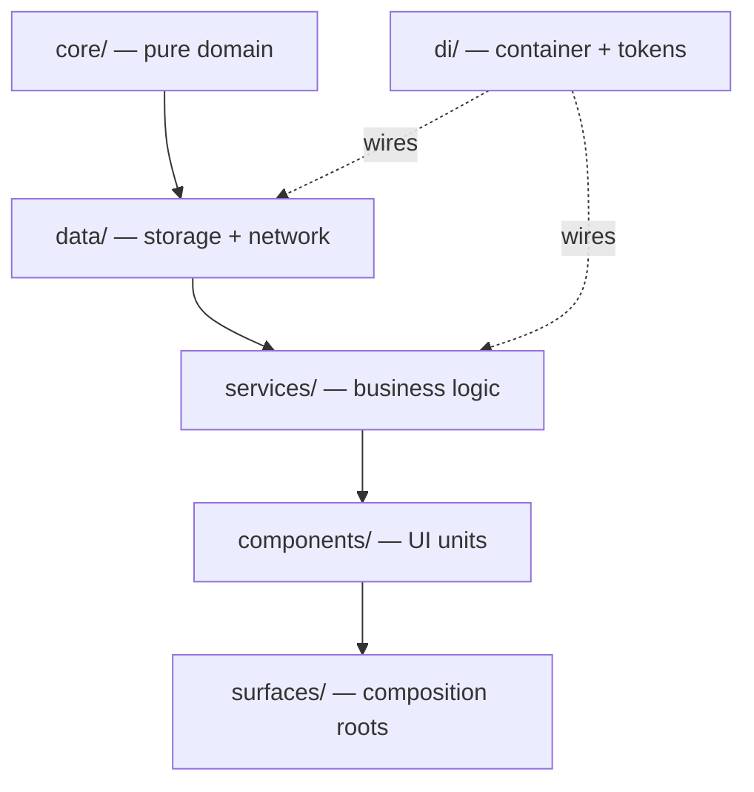

# Architecture

The extension is a **layered** architecture wired by a small dependency-injection
container. Dependency direction is strictly downward. Read this before adding
code; it is the standalone expansion of `docs/architecture.md`.

## Layered design

All application source is TypeScript (`.ts`); esbuild strips the types. The only
`.js` sources are `content/content.js` and the `tools/` scripts.

## Directory map

| Layer | Contents |
|---|---|
| `core/` | Pure domain. No DOM, no `chrome.*`, no I/O. Runs standalone in node. `phase2` (the four timeline rules), `report`, `slasummary`, `durations`, `aiextract`, `querybuilder`, `sntime`, `statechoices`, `names`, `msrchoices`, `msrcategorize`, `rowmerge`, `journal`, `templatexml`, `attention`, `calclens`. |
| `data/` | Everything that touches storage or the network. `repositories/` (ticket, timeline, settings, dataset, run-state, export-config, viewer-prefs, template, filter-list, msr-lists), `datasource/` (`sn-transport` session auth, `sn-remote` client), `idb.ts`, key-value stores, `classification-cache-repository.ts`, `ml-model-repository.ts`. |
| `services/` | Business logic. No DOM; depends on repositories, never on components. `pull`, `connection`, `settings`, `queue-scope`, `classifier`, `report`, `extract`, `export`, `remote-bridge`. |
| `components/` | OOP UI units that own their state and DOM: `Component` (base), `Modal`, `DataGrid`, `SearchPicker`, `MapDialog`, `CiDialog`, `LogCard`, `ProgressCard`, `ConditionBuilder`, `FilterSetList`, `ChipList`, `CalclensPanel`. Never touch `chrome.*`, `indexedDB`, or `fetch` — call a service. |
| `surfaces/` | Composition roots: `panel`, `settings`, `viewer`. The only place that knows both the container and the components. |
| `di/` | Container, tokens, and per-surface registration functions. |
| `lib/` | Platform and UI helpers: keys, storage, store, markup, picklist, servicenow, toast, tooltip, format, icons, icons-data. |
| `worker/` | Off-thread ML classification: `classifier-worker`, `ml-classify`. |
| `platform/` | The service worker (`background.ts`). |

### surfaces/viewer/

The viewer page's own composition root plus its modules (`core`, `store`,
`grid-data`, `cols`, `config-state`, `exporter`, `clipboard`, `summary`,
`toolbar`, `dialogs`, `grid`, `selection`, `activity`, `classify`, `calclens`,
`calclens-state`, `worker-client`, `shared`, `interactions`).
`surfaces/viewer/index.ts` calls each module's `init*()` in a fixed order and
then boots.

**Nothing binds DOM handlers at module scope.** Every module exports an
`init*()` and the composition root decides when it runs. Adding top-level wiring
to a viewer module re-introduces the invisible ordering this replaced.

## Layering rules

| Layer | May use | Must never |
|---|---|---|
| `core/` | only `core/` | `chrome.*`, `indexedDB`, `fetch`, DOM |
| `lib/` | `core/` | other layers |
| `data/` | `core/`, `lib/`, platform APIs | DOM, `services/`, `components/` |
| `services/` | `core/`, `lib/`, `data/` | DOM, `components/` |
| `components/` | `core/`, `lib/`, services via `deps` | repositories, `chrome.*`, `indexedDB`, `fetch` |
| `surfaces/` | everything | containing business logic |

## Download path (MV3 constraint)

The service worker never touches XLSX bytes. The viewer page loads the user's
cached template, patches only the target sheet's XML, and downloads via
`Blob` + `chrome.downloads.download`. Extension pages have
`URL.createObjectURL`; workers do not. Never move export building back into the
background. See [Export Internals](Export-Internals).

---
Related: [DI Container](DI-Container) · [Component Contract](Component-Contract) ·
[Two-Phase Pipeline](Two-Phase-Pipeline) · [Caching](Caching)
