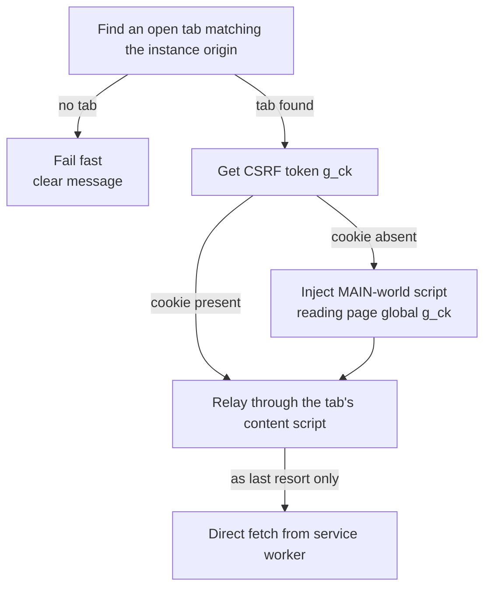

# Authentication Chain

The extension reuses your **logged-in ServiceNow browser session** — no API keys,
no Basic auth. All requests go through `data/datasource/sn-transport.ts` in a
strict order. Do not regress this order.

## The order (required)

1. **Find an open tab** matching the instance origin. **No tab → fail fast**
   with a clear message; session auth is impossible without it.
2. **Get the CSRF token**: try the `g_ck` cookie via `chrome.cookies`; if
   absent, inject a **MAIN-world** script that reads the page global `g_ck`.
3. **Relay through the tab's content script** so the same-origin fetch sends
   cookies first-party.
4. **Direct `fetch` from the service worker** is a last resort only.

## Why this shape (hard-won)

- MV3 service-worker fetches are **cross-site**: third-party cookie blocking
  breaks session cookies.
- Content scripts run in an **isolated world** — they cannot see page globals
  like `g_ck`; only a MAIN-world injection can.
- On current releases there is often no reliable `g_ck` cookie; the token lives
  as a JS variable in page context.
- ServiceNow rejects session-authenticated API calls missing `X-UserToken` with
  **401**.
- Users must **refresh their ServiceNow tab after reloading the extension**, or
  the content script won't exist yet.

## No-permission design (hardcoded scope)

The default flow makes **zero** metadata lookups: no `sys_choice`,
`sys_user_group`, `sys_user_grmember`, or `sys_user` reads — no such resolver
methods exist. Some users lack permission for those tables, so all scoping data
is configured by name instead:

- Queues and team members are plain **name** strings in settings (one per line;
  matching is case-insensitive).
- State/priority labels come from `core/statechoices.ts` out-of-box maps.

Only the selected ticket table plus the per-ticket activity feed
(`list_history.do`) are read during pulls. **COUNT** and **RUN** are the only
server operations; the panel's **Connect** is local-only validation.

## Security notes

- Never log or store full token values — diagnostics carry only the first 8
  chars.
- The instance URL comes from user input/storage and is always validated as
  `https://`.

---
Related: [Two-Phase Pipeline](Two-Phase-Pipeline) ·
[Running a Pull](Running-a-Pull) · [Troubleshooting and FAQ](Troubleshooting-and-FAQ)
