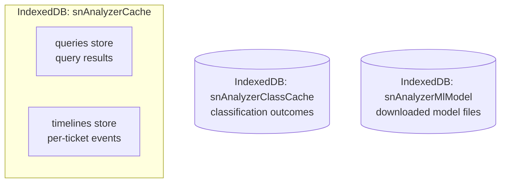

# Caching

The extension has **four distinct caches**, each with its own key, invalidation
rule, storage location, and clear control. They exist because the pull pipeline
is expensive: Phase 2 reads the activity feed **one request per ticket**, and ML
classification runs a 25–233 MB model over notes. Caching is what makes re-runs
survivable.

## Overview

| Cache | Store / DB | Key | Reuse rule | TTL / bound | Cleared by |
|---|---|---|---|---|---|
| Query (pull) | `queries` in `snAnalyzerCache` | hash of `table` + encoded query | same query within the TTL window | TTL, default 15 min, `0` disables | Clear pull cache |
| Timeline | `timelines` in `snAnalyzerCache` | `table:sys_id` | cached copy not older than the ticket's `sys_updated_on` | retained max 7 days | Clear pull cache |
| Classification | `entries` in `snAnalyzerClassCache` | FNV-1a of notes + both label lists + hints + model id | exact input match | ≤ 2000 entries, evicts least-used/oldest | Clear classification cache |
| ML model | `files` in `snAnalyzerMlModel` | `file:<repoId>:<file>` | files present for the requested model | until cleared | Clear model (repository `clear()`) |

The substrate is a thin IndexedDB wrapper in `data/idb.ts` (with an in-memory
twin for tests).

## 1. Query (pull) cache

`data/repositories/ticket-repository.ts` (`CachedTicketRepository`).

- **Key**: `queryKey(table, encodedQuery)` — a stable FNV-style hash of the
  table plus the encoded query.
- **Freshness**: `isFreshQuery` reuses an entry only while
  `now - entry.at < ttlMs`. At **exactly** the TTL the entry is stale (the
  comparison is deliberately strict).
- **TTL**: `DEFAULT_TTL_MS = 15 * 60 * 1000` (15 min). Configurable at runtime
  via `setQueryTtlMinutes`, driven by the **Query cache TTL (minutes)** setting
  (0–10080). `0` disables caching so every pull hits the API.
- **On hit**: the pull logs `CACHE HIT — reused N tickets from M min ago (no API
  calls)`.
- **On miss**: fetch, store `{ at, table, query, records }`, then `purgeExpired`
  drops stale query entries and timeline entries beyond retention.

Only `list()` is cached; `count()` always hits the API (Preview counts are
always live).

## 2. Timeline cache

`data/repositories/timeline-repository.ts` (`CachedTimelineRepository`).

- **Key**: `table:sysId`.
- **Invalidation by watermark**: `timelineNeedsFetch(entry, ticketUpdatedOn)`
  refetches when the cached copy is missing or **older than the ticket itself** —
  it compares the ticket's `sys_updated_on` against the entry's stored
  `updatedAt` (`ticketUpdatedOn > entry.updatedAt`). A ticket with no
  `sys_updated_on` is treated as fresh (no watermark to compare, so re-fetching
  every such ticket would defeat the cache).
- **Retention**: entries are pruned after `TIMELINE_RETENTION_MS = 7 days` by
  the query cache's `purgeExpired`.
- **On reuse**: Phase 2 logs `N/total timelines reused from cache`.

This cache is what makes re-runs affordable given the per-ticket,
no-batching Phase 2. It is **not** affected by the query TTL setting.

## 3. Classification result cache

`data/classification-cache-repository.ts` (`ClassificationCacheStore`), used by
`services/classifier-service.ts`.

- **Own database**: `snAnalyzerClassCache` — deliberately **not**
  `snAnalyzerCache`, so **Clear pull cache** never wipes classifier results.
- **Key**: `hashKey` — an FNV-1a hash over the exact inputs: the note text, both
  candidate label lists (root cause + resolution), the per-label keyword hints,
  and the **model id** (`"deterministic"` when ML is off). A changed note, a
  different ticket type's label list, or a different model each gets its own
  entry and is never served a stale result computed against different inputs.
- **Reuse**: on a hit the service returns the stored outcome and bumps the hit
  count (`noteHit`); on a miss it runs the compute and stores
  `{ outcome, savedAt, hits: 0 }`.
- **Bounded growth**: at most `MAX_ENTRIES = 2000`; eviction removes the
  least-used entries first (lowest `hits`, then oldest).
- **Toggle**: the **Cache classification results** setting; when off, the
  service runs with no cache and always re-classifies.
- **Cleared by**: **Clear classification cache** (`clear()`).

## 4. ML model cache

`data/ml-model-repository.ts` (`MlModelStore`).

- **Own database**: `snAnalyzerMlModel` (stores `meta` + `files`) — also
  separate from `snAnalyzerCache`, so clearing the pull cache never removes a
  downloaded model.
- **Key**: `file:<repoId>:<file>`. Files are keyed **per repoId**, so
  downloading a different model never touches a previously downloaded one, and
  every downloaded model shows as ready — not just the most recent.
- **Catalog** (`ML_MODEL_CATALOG`): MobileBERT (25.7 MB, default), DistilBERT
  (64.5 MB), NLI DeBERTa v3 (233 MB). All are quantized zero-shot NLI models run
  under Transformers.js.
- **Integrity**: `meta` is written only **after every file lands**, so
  `isReady()` never sees a half-downloaded model. A per-file 5-minute timeout
  turns a stalled download into a real error instead of hanging.
- **Cleared by**: the repository's `clear()`.

## Which "Clear" button clears what

- **Clear pull cache** (Settings) calls `getDefaultDatabase().clearAll()` on
  `snAnalyzerCache` — clears **queries** and **timelines** only.
- **Clear classification cache** empties `snAnalyzerClassCache`.
- The ML model is cleared separately and is never touched by the two buttons
  above.

This separation is intentional: clearing data must never force a multi-hundred-MB
model re-download or discard expensive classification work.

## Tests

| Suite | Covers |
|---|---|
| `tools/pull-cache-test.ts` | query cache policy through the repository |
| `tools/per-row-cache-test.js` | per-row (timeline) cache behaviour |
| `tools/classification-cache-test.js`, `tools/classify-cache-test.js` | classification result cache |
| `tools/ml-model-repository-test.js` | model download/caching |
| `tools/idb-test.ts` | the real IndexedDB path via fake-indexeddb |

See [Testing](Testing).

---
Related: [Configuration](Configuration) · [Two-Phase Pipeline](Two-Phase-Pipeline) ·
[Classification](Classification) · [Architecture](Architecture)
