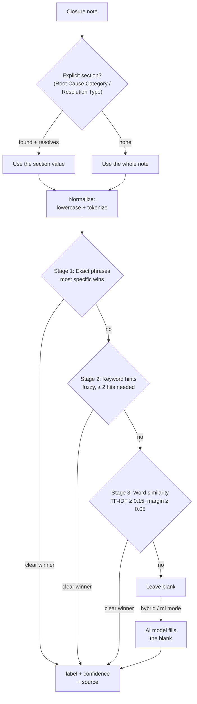
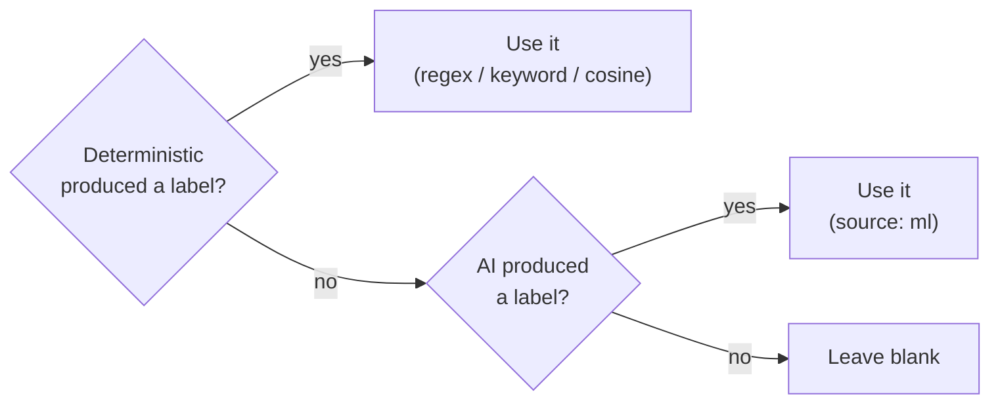

# Classification Algorithm

This page explains **how** the classifier decides a ticket's **Root cause
category** and **Solution type** from its closure notes. It starts in plain
language and then gets precise enough for a developer to re-derive a result by
hand. For the settings and modes, see [Classification](Classification).

## In one minute (plain language)

The tool reads the ticket's closure note and tries to pick the best label from
your allowed lists. It works like a careful human reader:

1. First it looks for an explicit heading in the note, like
   `Root Cause Category: Network issue`. If it finds one, it trusts that.
2. If there's no heading, it reads the whole note and looks for **strong exact
   phrases** it recognises (e.g. "certificate expired").
3. If nothing exact matches, it counts **familiar keywords** (e.g. "firewall",
   "port blocked") and picks the label with the most hits.
4. If keywords are inconclusive, it falls back to a **word-similarity** score
   between the note and each label's vocabulary.
5. If it's still unsure, it leaves the cell **blank** rather than guessing.
6. Optionally, a small offline **AI model** fills any cell still left blank.

Two important rules keep it honest:

- It **ignores negatives**: "no workaround needed" does **not** count as
  *Workaround*.
- It only auto-classifies **closed Incident / RFS** tickets; everything else is
  left untouched.

## The pipeline



Each field (root cause, solution type) runs through this independently, scored
against **its own** candidate list. Root cause uses the list for the ticket's
type (Incident / RFS / P-Ticket); solution type uses the resolution list.

Source: `core/msrcategorize.ts` (`categorizeField` → `classifyMsr`),
`core/aiextract.ts` (section extraction), `core/msrchoices.ts` (labels + hints),
`worker/ml-classify.ts` (the AI model).

## Step 1 — Find the explicit section (if any)

Notes often contain a labelled section. The extractor
(`core/aiextract.ts`) looks for a **header line** and captures its value.

- A line "looks like a header" when it has an early colon (within 45 chars) or
  is short (≤ 60 chars) — so a normal sentence that merely starts with a word
  like "Impact" is not mistaken for a header.
- Header matching is **fuzzy**: known variants plus a bounded edit distance, so
  typos still match. Recognised variants include:
  - Root cause: `root cause category`, `rootcause category`, `rca category`,
    `root cause cat`
  - Resolution: `resolution type`, `resoultion type` (typo), `solution type`,
    `resolved type`, `resolution status`
- The value captured is the text after the colon, plus following lines until the
  next header or a blank line.

**Example**

```
Investigation done.
Root Cause Category: Firewall
Resolution Type: Permanent solution
```

→ root-cause input = `Firewall`, solution-type input = `Permanent solution`.
Each captured value is then classified (Step 3). If the section value resolves
to a category it **wins**; otherwise the classifier falls back to the whole note.

**Example (typo header still works)**

```
Resoultion Type: workaround applied, monitoring
```

→ the misspelled header ("Resoultion") is matched by edit distance; value after
the colon = `workaround applied, monitoring`.

## Step 2 — Normalize the text

Before scoring, text is lowercased, stripped of punctuation, and split into
tokens (`norm` / `tokens`):

```
"Certificate EXPIRED on the LB!"  ->  ["certificate", "expired", "on", "the", "lb"]
```

The AI path additionally removes common filler words (`stripCommonWords`) so the
model spends its limited input budget on meaningful words — but it deliberately
**keeps** negation/qualifier words ("not", "no", "never", "only", "user",
"error", "access", "issue") so a phrase like "not an issue" can't be flipped
into its opposite.

## Step 3 — The deterministic scorer (three stages)

The scorer tries three stages **in order**. The **first stage with a clear
winner stops**; the remaining stages are skipped. The stages are not averaged.

---

### Stage 1 — Exact phrase match

**What it does:** looks for specific, pre-written phrases in the note. These
phrases are built into the code by the developers and **cannot be changed in
Settings**. If one matches and is not negated, that label wins immediately.

**How it differs from Stage 2:** Stage 1 phrases are fixed and exact — every
character must match (case-insensitive). Stage 2 hint phrases are user-editable
and tolerate misspellings. If you add a phrase in Settings, it goes to Stage 2.

**Examples of built-in phrases:**

| Label | Examples of exact built-in phrases |
|---|---|
| Network issue | `network`, `connectivity`, `packet loss`, `latency` |
| Firewall | `firewall`, `port blocked`, `blocked port` |
| Certificate expiry | `certificate expired`, `cert expiry`, `expired certificate` |
| User access issue | `access denied`, `cannot access`, `no access`, `permission denied` |
| Permanent solution | `permanent`, `patched`, `permanent fix`, `code change` |
| Workaround solution | `workaround`, `restart`, `reboot`, `temporary fix` |

**Negation rule:** if any of the 3 words before a phrase is a negator (no / not
/ never / without / cannot / don't / doesn't...), the match is **ignored**.

**Specificity rule:** when multiple labels match, the label whose **longest /
most-word phrase** matched wins. Example: `port blocked` (2 words) beats
`network` (1 word). A genuine tie falls through to Stage 2.

**Stage 1 example:**

Closure note:
```
Firewall change left a port blocked to the payment gateway.
Reconfigured the ACL — permanent fix applied.
```

What Stage 1 finds:
- `firewall` → *Firewall* match (1 word)
- `port blocked` → *Firewall* match (2 words, more specific)
- `permanent` → *Permanent solution* match (1 word)

Both are non-negated. *Firewall* wins root cause (most specific phrase: `port
blocked`). *Permanent solution* wins solution type.

Result: **Root cause = Firewall** (`regex`), **Solution type = Permanent
solution** (`regex`). Done — Stages 2 and 3 not reached.

**Negation example:**

Closure note:
```
This was not a network issue. A firewall rule was blocking traffic;
unblocked it permanently.
```

What Stage 1 finds:
- `network` — the 3 words before it are "was", "not", "a" — "not" is a negator
  → **this match is ignored**.
- `firewall` — no negator before it → *Firewall* match.
- `permanent` (inside "permanently") → *Permanent solution* match.

Result: **Root cause = Firewall** (`regex`), **Solution type = Permanent
solution** (`regex`). "Network issue" was correctly avoided.

---

### Stage 2 — Keyword hints (fuzzy match, user-extendable)

**What it does:** counts how many different **hint phrases** from each label's
list appear in the note. The label with the most hits wins — provided it has
**at least 2 hits** and a clear lead over the runner-up.

**How it differs from Stage 1:**

| | Stage 1 | Stage 2 |
|---|---|---|
| Phrases | Fixed, developer-written | Editable in Settings |
| Matching | Exact (case-insensitive) | Fuzzy — tolerates misspellings |
| Decision | One match is enough | Needs at least 2 hits |
| Typical use | Common, reliable phrases | Synonyms, domain names, typo-prone words |

**Why at least 2 hits?** A single keyword can appear in a note by coincidence.
Two separate hint phrases pointing at the same label is a much stronger signal.

**Fuzzy matching:** Stage 2 tolerates spelling mistakes based on word length:

| Word length | Typos tolerated |
|---|---|
| < 5 letters | 0 — must be exact |
| 5–7 letters | 1 letter off |
| ≥ 8 letters | 2 letters off |

Examples of what matches and what does not:

| Note word | Hint word | Length | Tolerance | Match? |
|---|---|---|---|---|
| `workarround` | `workaround` | 10/11 | 2 | ✓ yes |
| `permanant` | `permanent` | 9/9 | 2 | ✓ yes |
| `cfg` | `config` | 3/6 | 0 | ✗ no (too short) |
| `ntwk` | `network` | 4/7 | 0 | ✗ no (too short) |

**Stage 2 example — application-specific names reach 2 hits:**

Closure note:
```
Raised a case with Amadeus technical support. SITA also confirmed
the feed interruption was on their infrastructure side.
```

Stage 1 check: no *External-3rd party* exact phrases (`third party`, `3rd
party`, `external`, `vendor`, `supplier`) appear → Stage 1 inconclusive.

Stage 2 hint count for *External-3rd party*:
- `amadeus` — in hints list → hit #1
- `sita` — in hints list → hit #2
- No other label reaches 2 hits.

Result: **Root cause = External-3rd party** (`keyword`).

**Stage 2 example — misspelling still matches:**

Closure note:
```
Confirmed permanant fix deployed — code change went live at 14:00
and issue has not recurred since.
```

Stage 1 check: `/permanent/i` expects exact spelling — `permanant` does not
match → Stage 1 inconclusive.

Stage 2 hint count for *Permanent solution*:
- `permanant` vs hint `permanent` (9 letters, 1 difference) → within tolerance → hit #1
- `code change` — exact match in hints → hit #2

Result: **Solution type = Permanent solution** (`keyword`). The misspelling was
correctly absorbed.

---

### Stage 3 — Word similarity (TF-IDF cosine)

**What it does:** measures how much the vocabulary of the note **overlaps** with
the vocabulary of each label's hint document. This is the last resort — it fires
only when neither exact phrases nor counted hints produce a clear answer.

**Plain-language analogy:** imagine you have a short dictionary for each label
— all the words that label is associated with. Stage 3 scores each label by
asking "how many of this label's distinctive words appear in the note, and how
rarely do those words appear in other labels?". A word like "ssl" or "dns" is
very distinctive (it only appears in a few labels' dictionaries), so its
presence is a strong signal. A word like "issue" or "error" appears everywhere,
so it barely moves the needle.

**The rules:**
- Negated tokens are removed before scoring, so a negated cue cannot lift the
  wrong label's similarity.
- A label wins only if its similarity score is **≥ 0.15** (has meaningful
  overlap) **AND** beats the runner-up by **≥ 0.05** (has a clear lead).
- If neither threshold is met, the result is left blank — Stage 3 never guesses.

**Stage 3 example — technical jargon, no exact phrase or 2 hints:**

Closure note:
```
The handshake between our proxy and the vendor portal was failing.
SSL version mismatch — TLS 1.0 had been disabled on their side.
Updated our proxy config to enforce TLS 1.2. Regenerated the
certificates and validated the end-to-end connection.
```

Stage 1: none of `certificate expired`, `cert expiry`, `expired certificate`,
`certificate expiry` appear in the note → Stage 1 inconclusive.

Stage 2: *Certificate expiry* hints include `certificate`, `ssl`, `tls`.
Note has `ssl`, `tls`, `certificates` (fuzzy matches). But only 1 distinct hint
phrase clearly present → below the 2-hit bar → Stage 2 inconclusive.

Stage 3: the note is rich in vocabulary associated with *Certificate expiry*:
`ssl`, `tls`, `certificates`, `handshake`, `proxy`. These words appear in very
few other labels' hint documents, so they get high weight. The cosine similarity
for *Certificate expiry* leads all other labels by more than 0.05.

Result: **Root cause = Certificate expiry** (`cosine`).

**What Stage 3 cannot do:** if a note is too vague ("Investigated the issue,
applied a fix, all working now"), every label looks equally plausible and no
label clears both thresholds. The cell stays blank — Stage 3 does not guess.

---

### When nothing decides — blank and confidence

When a stage produces a winner, a **confidence score** is computed from how far
the winning label leads the second-best. The formula:

```
confidence = min(1,  bestScore × 0.2  +  (bestScore − secondScore) × 0.18)
```

If confidence falls below **0.32**, the result is **discarded** and the cell is
left blank — a barely-winning guess is worse than nothing.

Every filled cell is stamped with the stage that produced it (`regex` /
`keyword` / `cosine`). [Calclens](Calclens) shows this on each cell so you can
always see exactly *why* a value was chosen.

## Step 4 — The optional AI model

In **Hybrid** or **ML** mode, a small offline model (`worker/ml-classify.ts`)
fills any cell the deterministic scorer left blank. It is a **zero-shot NLI
classifier** (Transformers.js, WebAssembly), entirely offline after a one-time
download.

**How it works in plain language:** the model reads the note and, for each
candidate label, asks "does this note imply this label?". It scores every label
and returns the best one. It has no knowledge of the fixed phrases or hints — it
works purely from language understanding.

**Key rules:**
- The model's token limit is ~512. Long notes are trimmed (stopwords removed
  first to preserve as much content as possible).
- If the model is not downloaded, classification falls back to the deterministic
  scorer with a notice.
- A missing model file or runtime error resolves to "no label" — the
  deterministic result is never lost.

## Step 5 — How the two engines combine

The rule is simple: **deterministic always wins if it produced a label**.



The AI only fills a **blank**. It never overrides a clean regex/keyword/cosine
match. This is why **ML mode and Hybrid mode reach the same verdicts** — in both
modes, the deterministic cascade is authoritative and ML just fills the gaps.

## End-to-end worked examples

Five complete examples using realistic closure notes.

---

### Example A — Explicit section heading (fastest path)

Closure note:
```
User called about login failure on the payments portal.

Investigation: Certificate on gateway-lb01 had expired at midnight.
Root Cause Category: Certificate expiry
Resolution Type: Permanent solution

Renewed the wildcard certificate and restarted the LB service.
Verified login working post-change.
```

Trace:
1. Section extraction finds `Root Cause Category:` → value = `Certificate expiry`.
2. `classifyMsr("Certificate expiry", rootCauseLabels)` → regex
   `/certificate expiry/i` matches → **Root cause = Certificate expiry**
   (source `regex`).
3. Section extraction finds `Resolution Type:` → value = `Permanent solution`.
4. `classifyMsr("Permanent solution", resolutionLabels)` → regex `/permanent/i`
   matches → **Solution type = Permanent solution** (source `regex`).

Result: both fields filled from the explicit section. No ambiguity, highest
confidence path.

**Takeaway:** adding explicit `Root Cause Category:` / `Resolution Type:`
headings to your team's note template is the single most reliable way to get
correct classification.

---

### Example B — No heading, Stage 1 exact phrase decides

Closure note:
```
User could not open the Apex reporting dashboard — access denied error
shown on every attempt. Checked role assignments: the Apex viewer role
was missing from the account. Added the role and confirmed working via
screen share with the user.
```

Trace:
1. No `Root Cause Category:` or `Resolution Type:` heading → whole note used.
2. **Root cause — Stage 1:** scan for exact phrases.
   - `access denied` — contiguous, not negated → *User access issue* match.
   - No other label matches at equal or higher specificity.
   → **Root cause = User access issue** (source `regex`).
3. **Solution type — Stage 1:**
   - `confirmed working` — matches *Verification only* regex.
   → **Solution type = Verification only** (source `regex`).

Result: both fields from Stage 1. Stages 2 and 3 not reached.

**Important note about adjacency:** `access denied` matches because the two
words are next to each other in the note. If the note said "access was denied",
those words are not adjacent and Stage 1 would **not** match — the scorer would
fall to Stage 2 and look for hint counts.

---

### Example C — Negation prevents a wrong label; Stage 2 decides

Closure note:
```
This was NOT a network issue — all pings and traceroutes were clean.
Raised a case with Amadeus; SITA confirmed feed interruption was on
their side causing our data import to fail.
```

Trace:
1. No heading → whole note used.
2. **Root cause — Stage 1:** scan for exact phrases.
   - `network` — the 3 words before it are "not", "a" — "not" is a negator
     → **match is ignored**.
   - No other Stage 1 phrase matches.
   → Stage 1 inconclusive.
3. **Stage 2 — keyword hints for each label:**
   - *External-3rd party*: `amadeus` → hit #1, `sita` → hit #2 → **2 hits,
     clear lead over all other labels**.
   → **Root cause = External-3rd party** (source `keyword`).
4. **Solution type** — the note mentions "raising a case" and "confirmed
   interruption" but no resolution phrase. Both Stage 1 and Stage 2 are
   inconclusive. Stage 3 may score *Verification only* if vocabulary overlaps.

Result: **Root cause = External-3rd party** (`keyword`). Network issue
correctly avoided via negation.

---

### Example D — Paraphrased note, Stage 3 word similarity decides

Closure note:
```
The handshake between our proxy and the vendor portal kept failing.
SSL version mismatch — TLS 1.0 had been disabled on their end.
Updated the proxy configuration to enforce TLS 1.2. Regenerated
the certificates and validated end-to-end connection successfully.
```

Trace:
1. No heading → whole note used.
2. **Root cause — Stage 1:** none of the *Certificate expiry* exact phrases
   (`certificate expired`, `cert expiry`, `expired certificate`,
   `certificate expiry`) appear → Stage 1 inconclusive.
3. **Stage 2:** checking *Certificate expiry* hints (`certificate`, `ssl`,
   `tls`, etc.). The note has `ssl`, `tls`, `certificates` — but these are
   individual tokens, not the full multi-word hint phrases, so hint-phrase
   count stays below 2 → Stage 2 inconclusive.
4. **Stage 3 — word similarity:** the note is full of vocabulary concentrated
   in the *Certificate expiry* document — `ssl`, `tls`, `certificates`,
   `handshake`. These words appear in very few other labels' hint documents, so
   they carry high weight. The cosine score for *Certificate expiry* leads all
   others by more than 0.05.
   → **Root cause = Certificate expiry** (source `cosine`).
5. **Solution type — Stage 3:** "updated config", "regenerated", "validated" —
   vocabulary leans toward *Permanent solution*. If the cosine margin clears the
   threshold: **Permanent solution** (`cosine`); otherwise blank.

Result: Stage 3 handled a real-world note written in technical language without
any exact label vocabulary.

**Takeaway:** Stage 3 is the safety net for engineers who write technically
accurate notes without using the MSR label wording.

---

### Example E — AI fills a gap the deterministic scorer cannot

Closure note:
```
The self-check kiosk at gate B12 kept freezing during bag-drop.
Technician attended site, identified a faulty touchscreen module,
and replaced the entire unit. No further incidents reported.
```

Trace:
1. No heading → whole note used.
2. **Root cause — Stage 1:** *Hardware* exact phrases are `hard drive`, `disk
   failure`, `memory module`, `power supply`, `hardware` — none appear.
   Stage 1 inconclusive.
3. **Stage 2:** *Hardware* hints include `kiosk`, `barcode scanner`, `ssd`.
   Note has `kiosk` → hit #1. Only 1 hit — below the 2-hit bar.
   Stage 2 inconclusive.
4. **Stage 3:** "kiosk", "touchscreen", "module", "unit" — partially overlaps
   *Hardware* vocabulary, but may not reach the 0.05 margin over the runner-up
   with certainty.
   Stage 3 may be inconclusive.
5. **Deterministic root cause = blank.**
6. **AI model (Hybrid / ML mode):** the note is fed to the zero-shot NLI model.
   The model reads "kiosk", "faulty touchscreen module", "replaced the entire
   unit" and scores *Hardware* highest.
   → **Root cause = Hardware** (source `ml`).
7. **Solution type — Stage 1:** `replaced` is not in the exact phrase list.
   Stage 2: `permanent` not present; Stage 3: "replaced the entire unit" may
   lean toward *Permanent solution*. Or add `replaced` to *Permanent solution*
   keywords in Settings → Stage 2 fills it immediately.

Result: deterministic scorer fills solution type; AI fills root cause.

**Takeaway:** when your team uses domain-specific words the built-in patterns
don't know (`kiosk`, `replaced`), either add them as **keywords in Settings**
(instant, predictable, Stage 2) or rely on the AI model (broader but less
predictable). Keywords are the better long-term fix.

---

## Tuning the classifier

You can steer all three deterministic stages from **Settings** (see
[Configuration](Configuration)):

- **MSR option lists** set the **candidate labels** — the only values the
  classifier can output. Adding a label makes it matchable; removing one prevents
  it from ever being filled.
- **Classifier keywords** add **hint phrases** per label (Stage 2) and expand
  the cosine vocabulary (Stage 3). Add phrases your team actually uses — vendor
  names, application names, error wording.

Editing keywords or labels immediately re-runs classification on the loaded data.
Cached results are recomputed because the context fingerprint changes.

Practical tips:

- **To fix a systematic miss:** add the exact phrase your notes use as a keyword
  for the right label. Two distinct phrases appearing in a note is enough to win
  Stage 2.
- **To fix a wrong result:** check if a misleading phrase is in Stage 1's
  built-in list. If so, make sure your notes use negation when that phrase
  appears in a different context (Stage 1 negation is automatic).
- **You don't need anti-keywords:** because negation is respected, "no
  workaround" and "not a network issue" already don't score — no special action
  needed.
- **If cosine still misses:** add more synonyms as keywords for that label. More
  vocabulary in the hints document gives Stage 3 more signals to work with.
- **Last resort:** the AI model (Hybrid mode) handles paraphrasing and
  domain-specific language that built-in patterns miss.

---
Related: [Classification](Classification) · [Configuration](Configuration) ·
[Calclens](Calclens) · [Caching](Caching)
