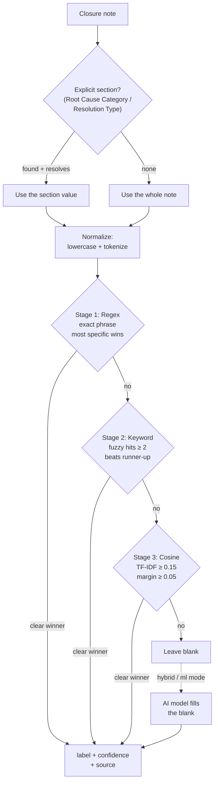
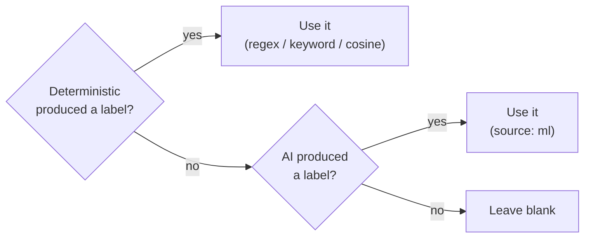

# Classification Algorithm

This page explains **how** the classifier decides a ticket's **Root cause
category** and **Solution type** from its closure notes. It starts in plain
language and then gets precise enough for a developer to re-derive a result by
hand. For the settings and modes, see [Classification](Classification).

## In one minute (plain language)

The tool reads the ticket's closure note and tries to pick the best label from
your allowed lists. It works like a careful human reader:

1. First it looks for an explicit heading in the note, like
   `Root Cause Category: Network issue`. If it finds one, it trusts that.
2. If there's no heading, it reads the whole note and looks for **strong exact
   phrases** it recognises (e.g. "certificate expired").
3. If nothing exact matches, it counts **familiar keywords** (e.g. "firewall",
   "port blocked") and picks the label with the most.
4. If keywords are inconclusive, it falls back to a **word-similarity** score
   between the note and each label's vocabulary.
5. If it's still unsure, it leaves the cell **blank** rather than guessing.
6. Optionally, a small offline **AI model** fills any cell still left blank.

Two important habits keep it honest:

- It **ignores negatives**: "no workaround needed" does **not** count as
  *Workaround*.
- It only auto-classifies **closed Incident / RFS** tickets; everything else is
  left untouched.

## The pipeline



Each field (root cause, solution type) runs through this independently, scored
against **its own** candidate list. Root cause uses the list for the ticket's
type (Incident / RFS / P-Ticket); solution type uses the resolution list.

Source: `core/msrcategorize.ts` (`categorizeField` → `classifyMsr`),
`core/aiextract.ts` (section extraction), `core/msrchoices.ts` (labels + hints),
`worker/ml-classify.ts` (the AI model).

## Step 1 — Find the explicit section (if any)

Notes often contain a labelled section. The extractor
(`core/aiextract.ts`) looks for a **header line** and captures its value.

- A line "looks like a header" when it has an early colon (within 45 chars) or
  is short (≤ 60 chars) — so a normal sentence that merely starts with a word
  like "Impact" is not mistaken for a header.
- Header matching is **fuzzy**: known variants plus a bounded edit distance, so
  typos still match. Recognised variants include:
  - Root cause: `root cause category`, `rootcause category`, `rca category`,
    `root cause cat`
  - Resolution: `resolution type`, `resoultion type` (typo), `solution type`,
    `resolved type`, `resolution status`
- The value captured is the text after the colon, plus following lines until the
  next header or a blank line.

**Example**

```
Investigation done.
Root Cause Category: Firewall
Resolution Type: Permanent solution
```

→ root-cause input = `Firewall`, solution-type input = `Permanent solution`.
Each captured value is then classified (Step 3). If the section value resolves
to a category it **wins**; otherwise the classifier falls back to the whole
note.

**Example (typo header still works)**

```
Resoultion Type: workaround applied, monitoring
```

→ the misspelled header ("Resoultion") is matched by edit distance, and the
value after the colon is captured = `workaround applied, monitoring`.

## Step 2 — Normalize the text

Before scoring, text is lowercased, stripped of punctuation, and split into
tokens (`norm` / `tokens`):

```
"Certificate EXPIRED on the LB!"  ->  ["certificate", "expired", "on", "the", "lb"]
```

The AI path additionally removes common filler words (`stripCommonWords`) so the
model spends its limited input budget on meaningful words — but it deliberately
**keeps** negation/qualifier words ("not", "no", "never", "only", "user",
"error", "access", "issue") so a phrase like "not an issue" can't be flipped
into its opposite.

## Step 3 — The deterministic scorer (three stages)

The scorer tries three stages **in order**; the **first stage with a clear
winner decides**. They are not averaged together.

### Stage 1 — Regex (exact phrases)

Each label has curated, exact, case-insensitive phrase patterns
(`BUILTIN_REGEX`). Example patterns:

| Label | Example patterns |
|---|---|
| Certificate expiry | `certificate expired`, `cert expiry`, `expired certificate` |
| Firewall | `firewall`, `blocked port`, `port blocked` |
| Network issue | `network`, `connectivity`, `packet loss`, `latency` |
| Permanent solution | `permanent`, `code change`, `permanent fix`, `patched` |
| Workaround solution | `workaround`, `temporary fix`, `reboot`, `restart` |

Rules:

- A match counts only if it is **not negated** (no negator in the 3 words
  before it).
- The **most specific** matched pattern wins — specificity is word count first,
  then length. `"port blocked"` (2 words) beats `"network"` (1 word).
- A genuine tie (same specificity and count) does **not** pick a winner; it
  falls through to Stage 2.

**Example**

```
"Firewall change left a port blocked to the payment gateway."
```

→ matches `firewall` (1 word) and the more specific `port blocked` (2 words),
both non-negated → Firewall wins at Stage 1, source `regex`.

**Negation example**

```
"This was not a network issue after all."
```

→ `network` is preceded by "not" (within 3 words) → the match is ignored.

### Stage 2 — Keyword hits (fuzzy)

If Stage 1 is inconclusive, the scorer counts how many of each label's **hint
phrases** appear (`DEFAULT_HINTS`, extendable in Settings). Matching is fuzzy:
misspellings are absorbed by a bounded edit distance (`within`) whose tolerance
grows with word length:

| Shorter word length | Max edit distance |
|---|---|
| < 5 chars | 0 (exact only) |
| 5–7 chars | 1 |
| ≥ 8 chars | 2 |

So `"permanant"` matches `"permanent"`, and `"workarround"` matches
`"workaround"`, but short words never cross-match. A label wins Stage 2 only
with **at least 2 hint phrases present** and a strict lead over the runner-up.
Negation is honoured here too (3-token window).

> Each hint phrase counts once (present or not), so "2 hits" means two
> *different* hint phrases were found. Strong phrases (like "network",
> "workaround") are usually in Stage 1's regex list, so Stage 2 mainly decides
> cases that regex does not cover — secondary synonyms or misspellings.

**Example** (no exact regex phrase, but two keyword hints)

```
"Raised with Amadeus; SITA confirmed the fault was on their side."
```

- *External-3rd party* hint phrases present: "amadeus" and "sita" → 2 hits.
- No `External-3rd party` regex phrase (third party / 3rd party / external /
  vendor / supplier) appears, so Stage 1 was inconclusive.

→ External-3rd party wins the root-cause field at Stage 2 (2 hits, clear lead),
source `keyword`.

### Stage 3 — TF-IDF cosine (word similarity)

If keywords are still inconclusive, the note is compared to each label's
"document" (the label text plus its hint phrases) using **TF-IDF cosine
similarity**. Words shared by many labels (e.g. "issue", "error") are
down-weighted so distinctive vocabulary dominates. Negated words are removed
first. A label wins only when its similarity is **≥ 0.15** and beats the
runner-up by **≥ 0.05**.

This stage catches notes that paraphrase a label without using an exact hint —
e.g. a note describing certificate/SSL/TLS wording leaning toward
*Certificate expiry* even if no exact hint phrase appears.

### Confidence and "leave it blank"

When a stage produces a winner, a confidence is computed from the score margin
between the best and second-best label:

```
confidence = min(1, bestScore * 0.2 + (bestScore - secondScore) * 0.18)
```

If confidence is below **0.32**, the result **collapses to blank** rather than
guessing. Every produced cell is stamped with the stage that produced it
(`regex` / `keyword` / `cosine`), which [Calclens](Calclens) surfaces so you can
see *why* a value was chosen.

## Step 4 — The optional AI model

In **Hybrid** or **ML** mode, a small offline model
(`worker/ml-classify.ts`) can fill cells the deterministic scorer left blank. It
is a **zero-shot NLI classifier** run through Transformers.js (WebAssembly),
entirely offline after a one-time download:

- The candidate labels become the model's hypotheses; it returns the best label
  and a score.
- Notes are trimmed (stopwords removed) and truncated to the model's ~512-token
  limit.
- Everything is defensive: a missing model, missing file, or runtime error
  resolves to "no label", and the deterministic result stands.

See [Classification](Classification) for the model catalog and
[Caching](Caching) for how the model and results are cached.

## Step 5 — How the two engines combine

The decision rule is simple and **always deterministic-first**
(`resolvePick` in `worker/ml-classify.ts`):



- If the deterministic cascade produced a label, it **wins outright** — the AI
  never overrides a clean regex/keyword/cosine match.
- The AI only fills a **blank** cell.
- That is why **ML mode and Hybrid mode reach the same verdicts**: in both, the
  deterministic cascade stays authoritative and ML just fills the gaps.

## End-to-end worked examples

**Example A — explicit section, exact match**

```
Root Cause Category: Certificate expiry
Resolution Type: Permanent solution
Renewed the expired TLS certificate on the load balancer.
```

- Section extraction gives root-cause input `Certificate expiry`, solution input
  `Permanent solution`.
- Stage 1 regex matches both exactly (`certificate expiry`, `permanent`) →
  **Root cause = Certificate expiry** (`regex`), **Solution type = Permanent
  solution** (`regex`). High confidence.

**Example B — no section, regex decides**

```
User reported access denied opening the app. Reset the role membership and confirmed working.
```

- No header → the whole note is used.
- Root cause: the contiguous phrase "access denied" matches the *User access
  issue* regex → **User access issue** (`regex`).
- Solution type: "confirmed working" matches the *Verification only* regex →
  **Verification only** (`regex`).

*(Note the contiguity rule: "access denied" matches, but "access was denied"
would not — the words must be adjacent. That is why this note is phrased with
the exact phrase.)*

**Example C — negation avoids a wrong label**

```
This was not a network issue. A firewall rule was blocking traffic; unblocked it permanently.
```

- The only "network" is negated ("not a network issue", within 3 words) → the
  *Network issue* match is ignored.
- "firewall" matches the *Firewall* regex (not negated) → **Firewall**
  (`regex`).
- "permanently" matches the *Permanent solution* regex (`permanent`) →
  **Permanent solution** (`regex`).

**Example D — deterministic blank, AI fills it (hybrid/ml)**

```
The kiosk near gate 12 kept freezing all morning; replaced the faulty unit.
```

- Root cause: no *Hardware* regex phrase matches ("kiosk"/"unit" are not curated
  patterns) and only the single hint "kiosk" is present (1 hit, below the
  2-hit keyword bar), so the deterministic root cause stays **blank**.
- In Hybrid/ML mode the AI evaluates the note against the root-cause list and
  can return **Hardware** → filled with source `ml`.
- Solution type: "replaced" matches the *Permanent solution* regex → **Permanent
  solution** (`regex`), decided deterministically regardless of mode.

## Tuning the classifier

You can shape all three deterministic stages from **Settings** (see
[Configuration](Configuration)):

- **MSR option lists** define the **candidate labels** — the only values the
  classifier can output. Adding/removing a label changes what can be matched.
- **Classifier keywords** extend the **hint phrases** per label (Stage 2) and
  the cosine vocabulary (Stage 3). Add domain terms your team uses
  (application names, error phrases) to a label to steer matches.
- Editing either re-runs classification on the loaded data and changes the
  context fingerprint, so cached results are recomputed (see
  [Classification](Classification)).

Practical tips:

- To fix a systematic miss, add the exact phrase your notes use as a **keyword**
  for the right label — two occurrences (or one strong, specific phrase) is
  enough to win Stage 2.
- Because negation is respected, you don't need "anti-keywords" for phrases like
  "no workaround"; they already won't score.
- If notes are paraphrased and keywords miss, the cosine stage often still
  catches them; if not, the AI model (Hybrid) is the safety net.

---
Related: [Classification](Classification) · [Configuration](Configuration) ·
[Calclens](Calclens) · [Caching](Caching)
