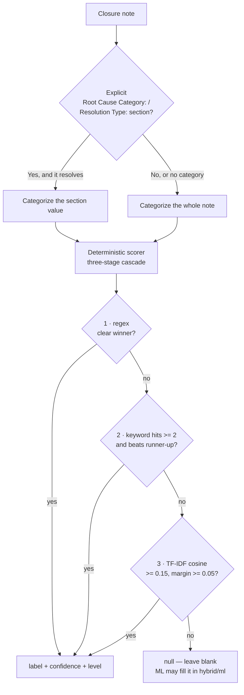

# Classification

The MSR **Root cause category** and **Solution type** columns are filled from
each ticket's closure notes. A built-in offline scorer always runs; an optional
local machine-learning model can fill what the scorer leaves blank.

## The label-directed cascade

**Label-directed:** if the note has an explicit `Root Cause Category:` or
`Resolution Type:` section, that value is categorized first; if it resolves to a
category it wins. Otherwise the whole note is categorized
(`categorizeField` in `core/msrcategorize.ts`).

**Three-stage cascade** (`classifyMsr`): the **first** stage with a clear winner
decides — they are not blended.

1. **Regex** — curated exact word-boundary patterns per label; the most
   *specific* (longest / most words) non-negated match wins, and a genuine tie
   falls through rather than guessing.
2. **Keyword** — fuzzy hint-phrase hit count (bounded edit distance absorbs
   misspellings like "permanant"); needs at least **2** hits and a strict lead
   over the runner-up.
3. **TF-IDF cosine** — note vs each label's hint document; needs cosine ≥ 0.15
   and a ≥ 0.05 margin.

**Negation** is honoured: a cue preceded (within 3 tokens) by no/not/without/
etc. does not score, so "no workaround needed" does not score *Workaround*.

**Confidence gating:** the winner's confidence comes from the score margin
between the best and second-best label; below the minimum (`minConfidence`,
0.32) the result collapses to **null** rather than guessing. Each produced cell
is stamped with the stage that produced it (`regex` / `keyword` / `cosine`), so
[Calclens](Calclens) can explain it.

## Which rows are classified

Auto-classification runs only on rows that are **note-bearing** and
**eligible** — a **closed Incident or RFS** ticket (`isClassifyEligible`).
Problem/change tickets and still-open tickets are never auto-scored, and any
value already on them is left untouched. Note-less and non-eligible rows are
counted as "not classifiable" in the progress tally.

A per-row cache also skips rows that already carry both valid MSR categories,
have **unchanged notes**, and were classified under the **current context**
(same model + label lists). Editing the MSR lists or switching model changes the
context fingerprint and forces a re-run, so a stale value is never shown.

## Modes

Set the mode under **Classification** in [Configuration](Configuration). In every
mode the **deterministic cascade is authoritative** — ML only ever fills cells
the scorer left blank, it never overrides an established heuristic value.

| Mode | Behaviour |
|---|---|
| **Heuristic only** (`heuristic`) | Deterministic scorer only, inline; no worker. Fills all eligible rows (existing valid values kept). |
| **Hybrid** (`hybrid`, default) | Deterministic pass fills blanks first, then the ML worker fills any cell still blank. |
| **ML only** (`ml`) | The ML worker evaluates every eligible note row, but the deterministic cascade stays authoritative and ML fills the blanks — so `ml` and `hybrid` converge on the same verdicts. |

The default mode is **Hybrid** and the default model id is **`mobilebert`**.
Switching the mode re-classifies the loaded data automatically.

If a mode needs ML but the selected model is **not downloaded**, classification
degrades to the built-in scorer and shows a notice ("ML model not downloaded —
using the built-in scorer").

## The ML model

The optional model is a zero-shot NLI classifier that runs under Transformers.js
(WebAssembly), entirely offline after a one-time download. Choose and download
it from Settings:

| Model | Size | Notes |
|---|---|---|
| MobileBERT (English) | 25.7 MB | Fast, tiny, first-use friendly. Best default. |
| DistilBERT (English) | 64.5 MB | Better accuracy, still quick to download. |
| NLI DeBERTa v3 (English) | 233 MB | Highest accuracy; a much larger one-time download. |

Downloaded models are cached locally and kept independently, so switching models
does not re-download a previously fetched one. See [Caching](Caching) for the
model cache, and [Configuration](Configuration) for the download control.

### How the model runs (off the UI thread)

ML inference runs in a **Web Worker** (`worker/classifier-worker.ts` →
`worker/ml-classify.ts`), driven from the viewer by
`surfaces/viewer/worker-client.ts`. The worker loads the cached model files
(verifying they match the selected model spec) and runs zero-shot NLI under
Transformers.js WebAssembly — which is why the extension's CSP allows
`wasm-unsafe-eval` (see [Architecture](Architecture)). Running off the main
thread keeps a large dataset from freezing the UI; rows are processed in
batches.

## Result cache

With **Cache classification results** enabled, each note's outcome is stored so
an unchanged note is never re-inferred on reload or across datasets. This is
detailed in [Caching](Caching).

## Where values land

Classified values populate MSR dropdown columns constrained to your
**MSR option lists**, so they always validate against
[Export](Export). Adjust the classifier's keyword hints under **Classifier
keywords** in [Configuration](Configuration).

---
Related: [Configuration](Configuration) · [Caching](Caching) ·
[Data Viewer](Data-Viewer) · [Export](Export)
