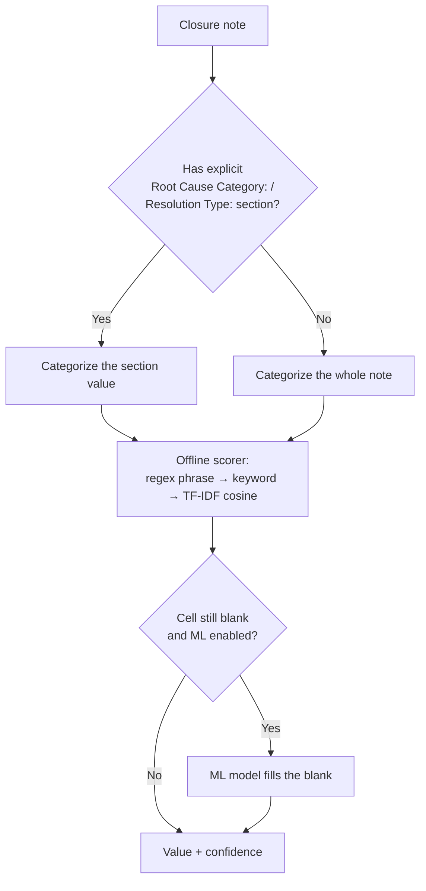

# Classification

The MSR **Root cause category** and **Solution type** columns are filled from
each ticket's closure notes. A built-in offline scorer always runs; an optional
local machine-learning model can fill what the scorer leaves blank.

## The label-directed cascade

1. If the note has an explicit `Root Cause Category:` or `Resolution Type:`
   section, the value there is categorized first.
2. Otherwise the whole note is categorized.

The offline scorer combines exact-phrase (regex), fuzzy keyword, and TF-IDF
cosine matching. It ignores negated cues (for example "no workaround needed"
does not score *Workaround*) and resolves competing matches by specificity.

Classification is **fill-if-blank**: rows that already carry both a solution
type and a root cause are left alone. Low-confidence results are flagged for
review.

## Modes

Set the mode under **Classification** in [Configuration](Configuration):

| Mode | Behaviour |
|---|---|
| **Heuristic only** | Built-in offline scorer only; no ML. |
| **Hybrid** | Offline scorer first, then the ML model when it finds a better answer. |
| **ML only** | Machine learning for every ticket. |

Switching the mode re-classifies the loaded data automatically.

## The ML model

The optional model is a zero-shot NLI classifier that runs under Transformers.js
(WebAssembly), entirely offline after a one-time download. Choose and download
it from Settings:

| Model | Size | Notes |
|---|---|---|
| MobileBERT (English) | 25.7 MB | Fast, tiny, first-use friendly. Best default. |
| DistilBERT (English) | 64.5 MB | Better accuracy, still quick to download. |
| NLI DeBERTa v3 (English) | 233 MB | Highest accuracy; a much larger one-time download. |

Downloaded models are cached locally and kept independently, so switching models
does not re-download a previously fetched one. See [Caching](Caching) for the
model cache, and [Configuration](Configuration) for the download control.

### How the model runs (off the UI thread)

ML inference runs in a **Web Worker** (`worker/classifier-worker.ts` →
`worker/ml-classify.ts`), driven from the viewer by
`surfaces/viewer/worker-client.ts`. The worker loads the cached model files
(verifying they match the selected model spec) and runs zero-shot NLI under
Transformers.js WebAssembly — which is why the extension's CSP allows
`wasm-unsafe-eval` (see [Architecture](Architecture)). Running off the main
thread keeps a large dataset from freezing the UI; rows are processed in
batches.

## Result cache

With **Cache classification results** enabled, each note's outcome is stored so
an unchanged note is never re-inferred on reload or across datasets. This is
detailed in [Caching](Caching).

## Where values land

Classified values populate MSR dropdown columns constrained to your
**MSR option lists**, so they always validate against
[Export](Export). Adjust the classifier's keyword hints under **Classifier
keywords** in [Configuration](Configuration).

---
Related: [Configuration](Configuration) · [Caching](Caching) ·
[Data Viewer](Data-Viewer) · [Export](Export)
