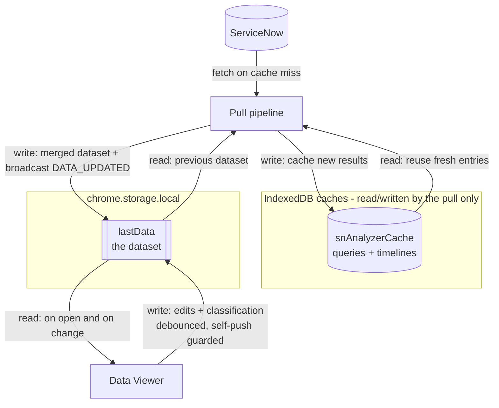

# Data Viewer

The data view is where you inspect, search, edit, classify, and export a pulled
dataset. Open it with **Open data view** in the panel.

## Where the data comes from

The viewer reads its rows from **`chrome.storage.local`**, under the `lastData`
key — **not** from the IndexedDB caches. The full read/write flow:

- **Pull → cache:** the pull reads ServiceNow through cached repositories — it
  reuses fresh entries from `snAnalyzerCache` (query + timeline stores) and
  writes new results back. See [Caching](Caching).
- **Pull → dataset:** the pull loads the previous dataset from `lastData`,
  **merges** the new rows in, writes the result to `lastData`
  (`DatasetStore.save`, `services/pull-service.ts`), and broadcasts
  `DATA_UPDATED`.
- **Viewer reads `lastData`:** on open (`hydrateStores`) and whenever it changes
  (`wireViewer` → `chrome.storage.onChanged`), so a pull run from the panel
  refreshes the grid live.
- **Viewer writes `lastData`:** your edits and classification results are saved
  back (debounced) via `saveData` / `persistEdits`. A `selfPush` guard makes the
  viewer ignore its **own** writes, so saving does not trigger a reload loop.

The classification and model caches (`snAnalyzerClassCache`,
`snAnalyzerMlModel`) are used by the viewer's classifier, but the **grid rows**
always come from `lastData`. The viewer never reads the pull's query/timeline
cache directly.

## The grid

A sortable, scrollable grid of the pulled tickets plus derived columns (assign,
acknowledge, suspend, resume, and derived durations). Times follow the
**instance clock**, not your browser — see [Timezone Contract](Timezone-Contract).

## Column-scoped search

Search within a single column or across all columns, with case and match-mode
options. The search matches the **displayed** value, so what you see is what you
search.

## Column editor

The column editor makes fast bulk edits to a **single column** across the
current view. It is type-aware (dropdown columns are restricted to their MSR
option lists), supports arrow-key navigation, a find filter, and Calclens
highlighting.

MSR dropdown columns (Root cause category, Solution type, etc.) are constrained
to the values configured under **MSR option lists** in
[Configuration](Configuration), so edited values always validate against export.

## CI split preview

Preview how a ticket's configuration items split into rows before committing, so
multi-CI tickets map correctly into the report.

## Ticket stats

A summary of the loaded dataset (counts and breakdowns) to sanity-check a pull.

## Classification and Calclens

- Root cause and solution type are filled from the closure notes — see
  [Classification](Classification).
- **Calclens** explains how each derived value (including SLA timings) was
  computed and flags rows needing attention — see [Calclens](Calclens).

## Export and Copy for MSR

Export the WSR (Weekly Status Report) workbook, or **Copy for MSR** to paste
formatted rows into your Monthly Status Report sheet without overwriting its
history — see [Export](Export).

---
Related: [Calclens](Calclens) · [Classification](Classification) ·
[Export](Export) · [Timezone Contract](Timezone-Contract)
