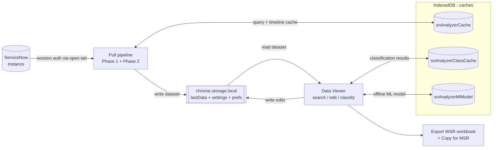

# Autonomous Reports Engine

A Chrome (Manifest V3, side-panel) extension that pulls ServiceNow ticket
timelines, analyzes SLA performance, classifies resolution notes, and exports a
filled Excel **WSR (Weekly Status Report)** workbook. It runs offline and reuses
your existing ServiceNow browser session, so it needs no API keys.

This wiki covers both **using** the extension and **developing** it.

> The pages under `wiki/` in the repository are the source of truth. They are
> published to the GitHub Wiki automatically on every push to `main`. Edit the
> files in `wiki/`, not the Wiki tab directly, or your change will be
> overwritten on the next sync. See [Contributing](Contributing).

## What it does

The Data Viewer never reads the pull pipeline (Phase 1 + Phase 2) directly: the
pull **writes** the merged dataset to `chrome.storage.local` (`lastData`) and
the viewer **reads** it from there (and writes edits back). The three IndexedDB
caches make re-runs cheap — `snAnalyzerCache` reuses query results and
per-ticket timelines, `snAnalyzerClassCache` reuses classification outcomes, and
`snAnalyzerMlModel` holds the one-time ML model download. See
[Caching](Caching) and [Data Viewer](Data-Viewer).

## User Guide

Start here if you want to run pulls and produce reports.

- [Installation](Installation) — build the extension and load it unpacked.
- [Quick Start](Quick-Start) — from install to your first export.
- [Configuration](Configuration) — every Settings control explained.
- [Running a Pull](Running-a-Pull) — the side panel workflow.
- [Filters and Presets](Filters-and-Presets) — conditions, filter sets, presets, WSR.
- [Data Viewer](Data-Viewer) — search, column editor, CI split, ticket stats.
- [Calclens](Calclens) — how each derived value was computed.
- [Why Time Conversions](Why-Time-Conversions) — why times are shown on the instance clock.
- [Classification](Classification) — root cause / solution type, heuristic and ML.
- [Classification Algorithm](Classification-Algorithm) — how the scorer decides, step by step.
- [Export](Export) — WSR workbook fill and Copy for MSR.
- [Backup and Transfer](Backup-and-Transfer) — export/import settings.
- [Troubleshooting and FAQ](Troubleshooting-and-FAQ) — common issues.

## Developer Guide

Start here if you want to build, test, or extend the code.

- [Architecture](Architecture) — layered design and layering rules.
- [DI Container](DI-Container) — tokens, `static deps`, per-container singletons.
- [Component Contract](Component-Contract) — build-once / patch-always.
- [Authentication Chain](Authentication-Chain) — session auth via the SN tab.
- [Two-Phase Pipeline](Two-Phase-Pipeline) — list then per-ticket timelines.
- [Timeline and SLA Rules](Timeline-and-SLA-Rules) — the four timeline rules.
- [Timezone Contract](Timezone-Contract) — instance clock, `fmtInstant`.
- [Caching](Caching) — query, timeline, classification, and model caches.
- [Export Internals](Export-Internals) — template XML patching and sheet lookup.
- [Building and Running](Building-and-Running) — dev/build/zip.
- [Testing](Testing) — the offline `node --test` suites.
- [Contributing](Contributing) — conventions and constraints.
- [Release Process](Release-Process) — tag-driven release workflow.
- [Roadmap](Roadmap) — known limits and forward-looking work.

## At a glance

| | |
|---|---|
| Platform | Chrome / Chromium, Manifest V3, side panel |
| Auth | Reuses your logged-in ServiceNow browser session (no API keys) |
| Tables | incident, change_request, problem, sc_req_item, sc_task |
| Output | Filled WSR (Weekly Status Report) `.xlsx` workbook, plus Copy for MSR (Monthly Status Report) |
| Storage | Local only: `chrome.storage.local` holds settings, the pulled dataset, and viewer prefs; three IndexedDB caches — `snAnalyzerCache` (query + timeline), `snAnalyzerClassCache` (classification results), `snAnalyzerMlModel` (ML model). See [Caching](Caching). |
