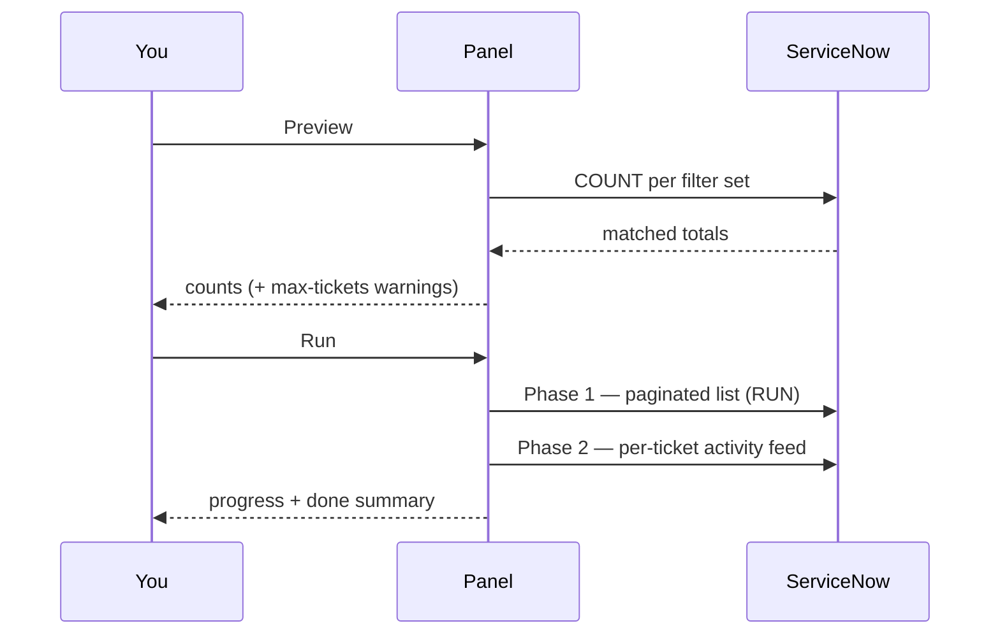

# Running a Pull

The side panel drives every pull. This page describes the panel from top to
bottom and the Preview / Run workflow.

## Header

- **Connection badge** — shows `Not connected` / `Connected`.
- **Settings** (gear) — opens the options page. See [Configuration](Configuration).

## Instance

Enter the **Instance URL** and click **Connect**. Connect is **local-only
validation** — it checks the URL shape and readiness; it does not call
ServiceNow. The actual authentication happens on the first request through your
logged-in tab (see [Authentication Chain](Authentication-Chain)).

## Filters

- **Ticket type** — Incident, Change Request, Problem, RITM, or SCTASK.
- **Conditions** — add condition rows with **+ Add condition**.
- **Saved filter sets** — build a list with **+ Add to filter list**; a Run
  pulls every set in the list. **Load preset** replaces the list with a saved
  preset (WSR is the built-in Weekly Status Report preset).
- **Pull change requests for Weekly Summary** — also pulls this week's change
  requests to fill the Weekly Summary sheet (last week implemented/failed, next
  week planned) plus P1/P2 incidents.
- **Advanced** — a raw encoded-query override and a preview of the generated
  query.

Filters and presets are covered in depth in
[Filters and Presets](Filters-and-Presets).

## Preview vs Run

- **Preview** runs a COUNT per filter set and shows how many tickets match,
  including any max-tickets-limit warnings.
- **Run** performs the two-phase pull:
  - **Phase 1** — the paginated ticket list from the Table API.
  - **Phase 2** — the per-ticket activity feed (`list_history.do`), replayed to
    compute the timeline and SLA values.

COUNT and RUN are the only server operations. See
[Two-Phase Pipeline](Two-Phase-Pipeline).

## Progress, log, and results

- A **progress bar**, **stage label**, and **pull counter** track the run.
- The **Log** card mirrors requests and activity; click its header to open the
  full **request & activity log** modal (with **Copy all**).
- The footer shows the **last run** summary.

When a pull reuses cached data you will see `CACHE HIT` messages in the log
(query results) and `timelines reused from cache` (Phase 2). See
[Caching](Caching).

## After a pull

Click **Open data view** to search, edit, classify, and export. See
[Data Viewer](Data-Viewer).

> Keep the ServiceNow tab open during a pull and export; requests and the file
> download rely on it.

---
Related: [Filters and Presets](Filters-and-Presets) ·
[Two-Phase Pipeline](Two-Phase-Pipeline) · [Data Viewer](Data-Viewer)
