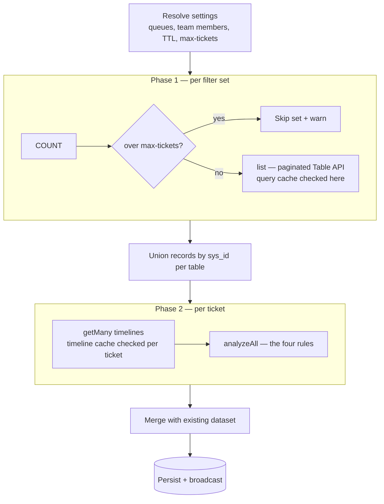

# Two-Phase Pipeline

A pull runs in two phases, orchestrated by `services/pull-service.ts`. This is
what makes a "pull" more than a handful of API calls: queue scoping, the
max-tickets guard, the per-table `sys_id` union, timeline reads, and the merge
with the existing dataset.

## Overview

## Phase 1 — the ticket list

For each filter set:

1. Build the encoded query from the set plus the queue scope
   (`core/querybuilder.ts`).
2. **COUNT** the matches. If a set exceeds **Max tickets per filter set**, it is
   **skipped with a warning** rather than pulled.
3. **list** the records (paginated Table API, default 1000 rows/page). The
   **query cache** is consulted here: a fresh cached result is reused with a
   `CACHE HIT` log line and no API calls. See [Caching](Caching).
4. Records are unioned into a per-table bucket keyed by `sys_id`, so the same
   ticket matched by two sets is not duplicated.

An optional **Weekly Summary** pass pulls change_request rows for last week and
next week in two scoped requests (kept separate because OR'ing the queue scope
makes the encoded query long enough for ServiceNow to reject with 400). These
need no timelines.

## Phase 2 — per-ticket timelines

For each table's bucket, `CachedTimelineRepository.getMany` reads the per-ticket
activity feed (`list_history.do`) — **one request per ticket, no batching** — and
returns events keyed by `sys_id`. The **timeline cache** serves unchanged
tickets without a request (`timelines reused from cache`). Then `analyzeAll`
(`core/phase2.ts`) replays each ticket's events to compute the four timeline
rules. See [Timeline and SLA Rules](Timeline-and-SLA-Rules).

Because Phase 2 is per-ticket with no batching, **keep per-ticket progress
reporting** and rely on the cache to make re-runs survivable.

## Merge and persist

Analysed rows are merged with the existing dataset (`core/rowmerge.ts`),
persisted, and a change is broadcast so the viewer refreshes. The run summary
reports pulled, total, missing-audit counts, and any skipped sets.

## Performance constraints

- Table API pages of 1000; exports can reach Excel's 1,048,576-row ceiling.
- Keep the ServiceNow tab open during pulls and exports (relay + node affinity).

---
Related: [Authentication Chain](Authentication-Chain) ·
[Timeline and SLA Rules](Timeline-and-SLA-Rules) · [Caching](Caching)
